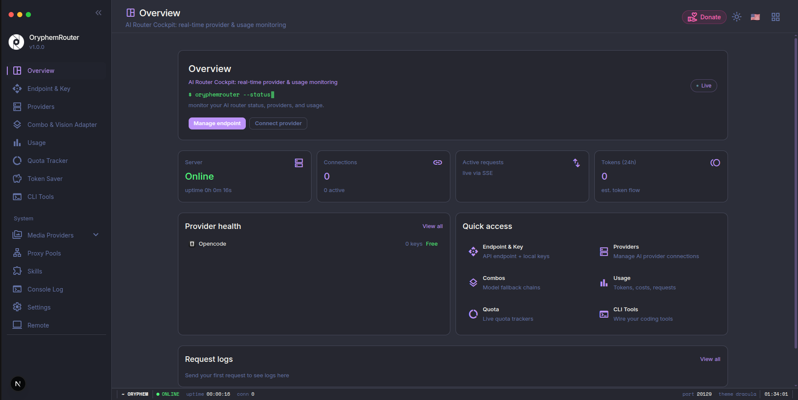

<div align="center">

# 🚀 OryphemRouter

**AI Router & Token Saver: Never stop coding. Save tokens, money and rate limits.**

[](https://www.npmjs.com/package/oryphemrouter)
[](https://nodejs.org)
[](https://github.com/virgiawanprima/OryphemRouter/pkgs/container/oryphemrouter)
[](https://github.com/virgiawanprima/OryphemRouter)
[](https://github.com/virgiawanprima/OryphemRouter)
[](https://github.com/virgiawanprima/OryphemRouter)
[](https://github.com/virgiawanprima/OryphemRouter/blob/main/LICENSE)

**Connect All AI Code Tools** (Claude Code, Cursor, Antigravity, Copilot, Codex, OpenCode, Cline, OpenClaw...) **to 380+ AI Providers & 1600+ Models.**



</div>

---

## 🌐 Bahasa / Language

- 🇬🇧 **English** (default): [README.md](./README.md)
- 🇮🇩 **Indonesia**: [README.id.md](./README.id.md)

---

## 📑 Table of Contents

- [📖 About](#-about)
- [🤔 Why OryphemRouter?](#-why-oryphemrouter)
- [🔄 How It Works](#-how-it-works)
- [⚡ Quick Start](#-quick-start)
- [💡 Key Features](#-key-features)
- [🧭 Dashboard Modules](#-dashboard-modules)
- [🎯 Routing Strategies](#-routing-strategies)
- [🆓 Free-Tier Budget Tracker](#-free-tier-budget-tracker)
- [💰 Spending Limits](#-spending-limits)
- [🛡️ Circuit Breaker](#️-circuit-breaker)
- [🔧 CLI Integration](#-cli-integration)
- [📊 Available Models](#-available-models)
- [🌐 Environment Variables](#-environment-variables)
- [🚀 Deployment](#-deployment)
- [📝 API Reference](#-api-reference)
- [🐛 Troubleshooting](#-troubleshooting)
- [🛠️ Tech Stack](#️-tech-stack)
- [🤝 Contributing](#-contributing)
- [🙏 Acknowledgments](#-acknowledgments)
- [🎁 Support](#-support)
- [📧 Contact](#-contact)
- [📄 License](#-license)

---

## 📖 About

**OryphemRouter** is a local **AI routing gateway** that consolidates all your AI coding needs into **one endpoint**. It brings:

- 🎯 **Auto-fallback** across providers (Subscription → Cheap → Free) so you **never stop coding**
- 💸 **Save 20-40% tokens** with integrated RTK Token Saver
- 🆓 **Free forever** with the built-in free tier catalog (Kiro, OpenCode Free, and more)
- 🔒 **100% local-first**: your data & API keys never leave your machine
- 🌍 **Dual language**: English & Indonesian

---

## 🤔 Why OryphemRouter?

**Stop wasting money, tokens and hitting limits:**

- ❌ Subscription quota expires unused every month
- ❌ Rate limits stop you mid-coding
- ❌ Tool outputs (git diff, grep, ls...) burn tokens fast
- ❌ Expensive APIs ($20-50/month per provider)
- ❌ Manual switching between providers

**OryphemRouter solves this:**

- ✅ **RTK Token Saver**: Auto-compress tool_result, save **20-40% tokens**
- ✅ **Maximize subscriptions**: Track quota, use every bit before reset
- ✅ **Auto fallback**: Subscription → Cheap → Free, zero downtime
- ✅ **Multi-account**: Round-robin between accounts per provider
- ✅ **Universal**: Works with Claude Code, Codex, Cursor, Cline, any CLI tool
- ✅ **Auto combo ranking**: AI scores and picks the best model
- ✅ **Circuit Breaker**: Providers erroring automatically get a 5-min cooldown
- ✅ **Spending Limits**: Limit monthly/daily costs to prevent surprise bills
- ✅ **Free-Tier Tracker**: Monitor remaining free quota per provider

---

## 🔄 How It Works

```
┌─────────────┐
│  Your CLI   │  (Claude Code, Codex, OpenClaw, Cursor, Cline...)
│   Tool      │
└──────┬──────┘
       │ http://localhost:20129/v1
       ↓
┌─────────────────────────────────────────────┐
│        OryphemRouter (Smart Router)         │
│  • RTK Token Saver (cut tool_result tokens) │
│  • Format translation (OpenAI ↔ Claude)     │
│  • Quota tracking                           │
│  • Auto token refresh                       │
│  • Auto combo ranking (AI-scored)            │
│  • Circuit breaker + spending limits        │
└──────┬──────────────────────────────────────┘
       │
       ├─→ [Tier 1: SUBSCRIPTION] Claude Code, Codex, GitHub Copilot
       │   ↓ quota exhausted
       ├─→ [Tier 2: CHEAP] GLM, MiniMax, Kimi
       │   ↓ budget limit
       └─→ [Tier 3: FREE] Kiro, OpenCode Free, Pollinations

Result: Never stop coding, minimal cost + 20-40% token savings via RTK
```

---

## ⚡ Quick Start

### 📋 Requirements

| OS | Requirement |
|----|-------------|
| 🪟 **Windows** | Windows 10/11, Node.js 20+ |
| 🍎 **macOS** | macOS 12+, Node.js 20+ |
| 🐧 **Linux** | Ubuntu/Debian/Fedora/Arch, Node.js 20+ |
| 🐳 **Docker** | Docker 20.10+ (all platforms) |

> **Node.js 20+** is required. Get it from [nodejs.org](https://nodejs.org) or use your OS package manager.

### 🪟 Windows / 🍎 macOS / 🐧 Linux

Clone and run from source:

```bash
git clone https://github.com/virgiawanprima/OryphemRouter.git
cd OryphemRouter
npm install

# Development (hot reload)
npm run dev

# Production
npm run build
npm run start
```

> **Node.js 20+** is required. Get it from [nodejs.org](https://nodejs.org).
>
> Want a standalone launcher? The bundled CLI lives in [`cli/`](./cli/) and exposes an `oryphemrouter` bin (start/stop the server, tray UI on desktop).

### 🐳 Docker (any OS)

```bash
docker run -d --name oryphemrouter \
  -p 20129:20129 \
  -v "$HOME/.oryphemrouter:/app/data" \
  -e DATA_DIR=/app/data \
  ghcr.io/virgiawanprima/oryphemrouter:latest
```

### ✅ Verify installation

```bash
curl http://localhost:20129/api/health
# → healthy response
```

🎉 Dashboard opens at `http://localhost:20129`

---

## 💡 Key Features

| Feature | What It Does | Why It Matters |
|---------|--------------|----------------|
| 🚀 **RTK Token Saver** | Compress tool outputs before sending to LLM | Save **20-40% input tokens** per request |
| 🧠 **Headroom Token Saver** | External `/v1/compress` proxy | Save more context tokens |
| 🪨 **Caveman Mode** | Inject caveman-speak prompt | Save **up to 65% output tokens** |
| 🐴 **Ponytail** | "Lazy senior dev" system prompt | Fewer tokens, less code |
| 🎯 **Smart 3-Tier Fallback** | Auto-route: Subscription → Cheap → Free | Never stop coding |
| 📊 **Real-Time Quota Tracking** | Live token count + reset countdown | Maximize subscription value |
| 🔄 **Format Translation** | OpenAI ↔ Claude ↔ Gemini ↔ Cursor ↔ Kiro ↔ Vertex | Works with any CLI tool |
| 👥 **Multi-Account Support** | Multiple accounts per provider | Load balancing + redundancy |
| 💰 **Spending Limits** | Max cost per day/month + auto-pause | Prevent surprise bills |
| ⚡ **Auto Combo Ranking** | AI-scored model ranking for `auto` strategy | Pick the best model automatically |
| 🛡️ **Circuit Breaker** | 5 errors → 5-min cooldown, auto-recover | Resilience against dead providers |
| 🆓 **Free-Tier Tracker** | Live free quota usage per provider | Maximize free usage |
| 🎨 **Custom Combos** | Group models, pick a strategy per combo | Tailor fallback to your needs |
| 🖼️ **Media Providers** | TTS/STT, images, video, music, OCR, rerank, moderation | One gateway for every media kind |
| 🧩 **Proxy Pools** | Rotate outbound proxies & per-provider strategies | Bypass geo/rate restrictions |
| 🔀 **Translator** | Convert request/response formats live | Frictionless provider swap |
| 💡 **Skills & MCP** | Agent skills-pack + MCP plugin server | Extend agents with one click |
| 🌐 **Deploy Anywhere** | Localhost, VPS, Docker, Cloudflare/Firebase | Flexible deployment |

---


## 🧭 Dashboard Modules

The OryphemRouter dashboard is organized into focused modules. Here is what each one does.

### 📡 Providers

Manage all AI provider connections from one place.

- **Connect providers**: Claude Code, Codex, GitHub Copilot, Cursor, Kiro, OpenCode, GLM, MiniMax, Kimi, and 380+ more.
- **OAuth login**: One-click OAuth for subscription providers (Claude Code, Codex, GitHub, Cursor, Kiro).
- **API keys**: Add, edit, pause, or delete API keys per provider. Supports **bulk add** with auto-naming:
  ```
  name1|sk-key1
  name2|sk-key2
  sk-key-only-auto-named
  ```
- **Multi-account**: Add several accounts per provider. OryphemRouter round-robins between them and falls back to the next account on failure.
- **Test connection**: Validate an API key before saving with the built-in connection tester.
- **Provider-specific data**: Set base URLs, regions, or deployments for Azure, Cloudflare AI, Ollama-local, and compatible endpoints.

### 🔌 Endpoint

The gateway's front door: one OpenAI-compatible URL for all your tools.

- **Local endpoint**: `http://localhost:20129/v1` (your CLI tools point here).
- **API keys**: Create and manage keys used to authenticate requests to `/v1/*`.
- **Require API key toggle**: Enforce `Bearer` authentication on every request.
- **Cloudflare Tunnel**: Expose your local gateway to the internet in one click (no port forwarding).
- **Tailscale Funnel**: Alternative remote access through your Tailscale network.
- **Realtime status**: The dashboard streams tunnel/Tailscale health live via SSE, no refresh needed.

### 🎨 Combos

Group models under one name and pick a routing strategy.

- **Create a combo**: name it, add models in priority order (drag to reorder).
- **Templates**: one-click **Free Combo** (free models first) or **Premium Combo** presets.
- **Per-combo strategy**: Fallback, Round Robin, Fusion, Pipeline, or Auto (see Routing Strategies).
- **Capacity adapter**: automatic fallback pools for vision/audio when the target model lacks a capability.
- **Use it anywhere**: reference the combo name as the `model` in any CLI tool.

### 📊 Usage & Analytics

Track every request that flows through the gateway.

- **Request log**: recent requests with provider, model, tokens, cost, and status.
- **Charts**: token usage and cost over time (today, 24h, 7d, 30d).
- **Per-provider breakdown**: which provider/model consumed what.
- **Request details**: drill into a single request to inspect headers, payload, and timing.
- **Real-time**: the usage view updates live via SSE as requests complete.

### 📈 Quota Tracker

Watch your provider quotas so you never hit a wall mid-session.

- **Per-provider quota**: remaining tokens/credits and reset countdown.
- **Auto-ping**: optional scheduled quota checks for Claude Code and Codex accounts.
- **Reset timers**: 5-hour, daily, weekly, or monthly reset countdowns.
- **Alerts**: see at a glance when a provider is near its limit so fallback kicks in smoothly.

### 🖼️ Media Providers

One gateway for every AI media kind — not just chat.

- **Kinds**: Text-to-Speech, Speech-to-Text, Text-to-Image, Video, Music, Embeddings, Web Search, Web Fetch, Image Upscale, OCR, Rerank, Moderation.
- **Per-kind routes**: each kind maps to its own endpoint (e.g. `/v1/audio/speech`, `/v1/images/generations`, `/v1/videos/generations`).
- **Combos for media**: group multiple providers under one media combo, with its own round-robin/fallback strategy.
- **Voice & model catalogs**: live voice/model lists per provider (e.g. ElevenLabs, Deepgram, MiniMax voices).

### 🧩 Proxy Pools

Route upstream traffic through outbound proxies.

- **Pool management**: add, test, and disable SOCKS5/HTTP proxies.
- **Per-provider strategies**: assign a rotation strategy (`round-robin`, `none`, ...) to a pool.
- **Security**: keep your home IP private while calling providers.

### 🔀 Translator

Live request/response format conversion between providers.

- **Convert messages**: OpenAI ↔ Claude ↔ Gemini ↔ Cursor ↔ Kiro ↔ Vertex.
- **Save/load presets**: reusable translation profiles.
- **Console logs**: inspect live translation output via SSE.

### 💡 Skills & MCP

Extend your coding agents with skills and MCP servers.

- **Skills pack**: install agent skills that route through OryphemRouter.
- **MCP server**: expose tools over the Model Context Protocol (`/api/mcp/*`).

### 💾 Token Saver

Cut token usage automatically before requests hit the LLM.

- **RTK Token Saver**: compresses `tool_result` output (git diff, grep, ls, logs) losslessly, saving 20-40% input tokens. Toggle per request with `x-oryphemrouter-token-saver: off`.
- **Headroom**: optional external `/v1/compress` proxy for even more context savings.
- **Caveman Mode**: terse, caveman-style output, saving up to 65% output tokens.
- **Ponytail**: "lazy senior dev" prompt that writes minimal, YAGNI-first code.
- **PXPIPE**: transparent request compression for supported tools.

### 🛠️ CLI Tools

One-click configuration for your coding agents.

- **Auto-detect**: OryphemRouter detects installed CLI tools (Claude Code, Codex, OpenClaw, Cursor, Cline, etc.).
- **Apply config**: point any tool at the local endpoint with a couple of clicks.
- **Per-tool settings**: API key selection, endpoint presets, model picker, and config file edits.
- **Verify status**: see whether each tool is wired up and where its config lives.

---

## 🎯 Routing Strategies

OryphemRouter supports **4 routing strategies** per combo:

| Strategy | How It Works | Cost |
|----------|--------------|------|
| **1. Fallback** (default) | Try models in order, move to next on failure | Cheap |
| **2. Round Robin** | Rotate models across requests to spread load | Cheap |
| **3. Fusion** | Query all models in parallel, judge synthesizes one answer | Expensive (N+1) |
| **4. Cost-Optimized** ⭐ | Auto-order from cheapest to most expensive, fallback on failure | Minimal |

**How to use:** Dashboard → Combos → create a combo → pick strategy in Profile Settings.

---

## 🆓 Free-Tier Budget Tracker

The `/dashboard/free-tiers` page displays **free quota usage** in real-time:

| Provider | Type | Quota | Reset |
|----------|------|-------|-------|
| **Kiro AI** | Credits | 50 credits/mo | Monthly (1st) |
| **OpenCode Free** | Unlimited | ∞ | None |
| **Vertex AI** | Credits | $300 | One-time (90 days) |
| **Felo** | Unlimited | ∞ | None |

- 🟢 *Used / remaining* progress bar per provider
- 🔄 Auto-refresh every 60 seconds
- 📊 Cumulative free budget total

---

## 💰 Spending Limits

Prevent surprise bills with **spending limits**:

```js
// Settings → Profile → Spending Limits
spendingLimits: {
  maxCostPerMonth: "10",   // max $10/month
  maxCostPerDay: "2",      // max $2/day
  autoPause: true,         // auto-pause when limit reached
  fallbackToFree: true     // fallback to free providers if limit reached
}
```

- 🔒 **autoPause: true**: requests blocked when limit reached
- 🔄 **fallbackToFree: true**: keep working with free providers
- 🚫 **fallbackToFree: false**: block request with 403

---

## 🛡️ Circuit Breaker

Automatic resilience against problematic providers:

```
Error 1..4   → normal cooldown (exponential backoff)
Error 5      → 🔴 CIRCUIT OPEN (5-min cooldown)
Success      → 🟢 circuit reset (error count = 0)
```

- **Threshold:** 5 consecutive errors
- **Cooldown:** 5 minutes
- **Auto-recover:** after cooldown ends

---

## 🔧 CLI Integration

### Cursor IDE

```
Settings → Models → Advanced:
  OpenAI API Base URL: http://localhost:20129/v1
  OpenAI API Key: [from dashboard]
  Model: cc/claude-opus-4-7
```

### Claude Code

Edit `~/.claude/config.json`:

```json
{
  "anthropic_api_base": "http://localhost:20129/v1",
  "anthropic_api_key": "your-oryphemrouter-api-key"
}
```

### Codex CLI

```bash
export OPENAI_BASE_URL="http://localhost:20129"
export OPENAI_API_KEY="your-oryphemrouter-api-key"
codex "your prompt"
```

### OpenClaw

Dashboard → CLI Tools → OpenClaw → Select Model → Apply

### Cline / Continue / RooCode

```
Provider: OpenAI Compatible
Base URL: http://localhost:20129/v1
API Key: [from dashboard]
Model: cc/claude-opus-4-7
```

---

## 📊 Available Models

### 🆓 Free

| Prefix | Provider | Models |
|--------|----------|--------|
| `kr/` | Kiro AI (50 credits/mo) | `claude-sonnet-4.5`, `claude-haiku-4.5`, `glm-5`, `MiniMax-M2.5` |
| `oc/` | OpenCode Free | Auto-fetched from `opencode.ai/zen/v1/models` |
| `vertex/` | Vertex AI ($300 credits) | `gemini-3.1-pro-preview`, `gemini-3-flash-preview` |

### 💰 Cheap

| Prefix | Provider | Cost | Models |
|--------|----------|------|--------|
| `glm/` | GLM | $0.6/1M | `glm-5.1`, `glm-5`, `glm-4.7` |
| `minimax/` | MiniMax | $0.2/1M | `MiniMax-M2.7`, `MiniMax-M2.5` |
| `kimi/` | Kimi | $9/mo flat | `kimi-k2.5`, `kimi-k2.5-thinking` |

### 💳 Subscription

| Prefix | Provider | Models |
|--------|----------|--------|
| `cc/` | Claude Code | `claude-opus-4-7`, `claude-opus-4-6`, `claude-sonnet-4-6` |
| `cx/` | Codex | `gpt-5.5`, `gpt-5.4`, `gpt-5.3-codex` |
| `gh/` | GitHub Copilot | `gpt-5.4`, `claude-opus-4.7`, `claude-sonnet-4.6` |
| `cu/` | Cursor | `claude-4.6-opus-max`, `claude-4.5-sonnet-thinking` |

---

## 🌐 Environment Variables

| Variable | Default | Description |
|----------|---------|-------------|
| `JWT_SECRET` | Auto-generated | JWT signing secret for auth cookie |
| `INITIAL_PASSWORD` | `123` | First login password |
| `DATA_DIR` | `~/.oryphemrouter` | Main app data location (SQLite) |
| `PORT` | `20129` | Service port |
| `HOSTNAME` | framework default | Bind host (Docker: `0.0.0.0`) |
| `NODE_ENV` | runtime default | `production` for deploy |
| `BASE_URL` | `http://localhost:20129` | Internal base URL for cloud sync |
| `CLOUD_URL` | `https://oryphem.com` | Cloud sync endpoint |
| `API_KEY_SECRET` | `endpoint-proxy-api-key-secret` | HMAC secret for API keys |
| `MACHINE_ID_SALT` | `endpoint-proxy-salt` | Salt for machine ID |
| `ENABLE_REQUEST_LOGS` | `false` | Enable request logs |
| `REQUIRE_API_KEY` | `false` | Enforce Bearer API key on `/v1/*` |

> 📄 See [`.env.example`](./.env.example) for the full reference with OAuth client variables.

---

## 🚀 Deployment

### 🐳 Docker

The image is published on **GHCR** (multi-platform):

```bash
docker pull ghcr.io/virgiawanprima/oryphemrouter:latest

docker run -d \
  --name oryphemrouter \
  -p 20129:20129 \
  -v "$HOME/.oryphemrouter:/app/data" \
  -e DATA_DIR=/app/data \
  ghcr.io/virgiawanprima/oryphemrouter:latest
```

→ Open http://localhost:20129

### ☁️ VPS

```bash
git clone https://github.com/virgiawanprima/OryphemRouter.git
cd OryphemRouter
npm install
npm run build

export JWT_SECRET="your-secure-secret"
export INITIAL_PASSWORD="your-password"
export DATA_DIR="/var/lib/oryphemrouter"
export PORT="20129"
export HOSTNAME="0.0.0.0"
export NODE_ENV="production"

npm run start

# PM2
npm install -g pm2
pm2 start npm --name oryphemrouter -- start
pm2 save
pm2 startup
```

### 🐳 docker-compose

```yaml
services:
  oryphemrouter:
    image: ghcr.io/virgiawanprima/oryphemrouter:latest
    ports:
      - "20129:20129"
    volumes:
      - oryphemrouter-data:/app/data
    environment:
      DATA_DIR: /app/data
      PORT: "20129"
volumes:
  oryphemrouter-data:
```

---

## 📝 API Reference

### Chat Completions

```bash
POST http://localhost:20129/v1/chat/completions
Authorization: Bearer your-api-key
Content-Type: application/json

{
  "model": "cc/claude-opus-4-7",
  "messages": [
    {"role": "user", "content": "Write a function to..."}
  ],
  "stream": true
}
```

### List Models

```bash
GET http://localhost:20129/v1/models
Authorization: Bearer your-api-key
```

### Real-time Status (SSE)

```bash
GET http://localhost:20129/api/dashboard/realtime
# Server-Sent Events: active requests, tunnel status, tailscale status
```

---

## 🐛 Troubleshooting

**"Language model did not provide messages"**

- Provider quota exhausted → Use combo fallback or switch to cheaper tier

**Rate limiting**

- Subscription quota out → Fallback to GLM/MiniMax
- Add combo: `cc/claude-opus-4-7 → glm/glm-5.1 → kr/claude-sonnet-4.5`

**OAuth token expired**

- Auto-refreshed by OryphemRouter
- If issues persist: Dashboard → Provider → Reconnect

**High costs**

- Enable RTK in Dashboard → Endpoint settings (default ON, saves 20-40% tokens)
- Set Spending Limits in Profile → Spending Limits
- Use free tier (Kiro, OpenCode Free, Vertex) for non-critical tasks

**Dashboard opens on wrong port**

- Set `PORT=20129` and `NEXT_PUBLIC_BASE_URL=http://localhost:20129`

**First login not working**

- Check `INITIAL_PASSWORD` in `.env`
- Fallback password is `123`

---

## 🛠️ Tech Stack

| Layer | Technology |
|-------|------------|
| **Runtime** | Node.js 20+ |
| **Framework** | Next.js 16 |
| **UI** | React 19 + Tailwind CSS 4 |
| **Database** | SQLite (better-sqlite3 / node:sqlite / sql.js fallback) |
| **Streaming** | Server-Sent Events (SSE) |
| **Auth** | OAuth 2.0 (PKCE) + JWT + API Keys |
| **i18n** | Dual language (English + Indonesian) |

---

## 🤝 Contributing

Contributions are welcome! Here's how:

1. 🍴 **Fork** the repository on [GitHub](https://github.com/virgiawanprima/OryphemRouter)
2. 🌿 **Create a branch**: `git checkout -b feat/your-feature`
3. ✍️ **Make your changes** (see the [Contributing Guide](./CONTRIBUTING.md))
4. ✅ **Test** (unit): `npx vitest --config tests/vitest.config.js tests/unit/`
5. ✅ **Test** (E2E): `npx playwright test tests/e2e/` (start the server first: `npm run dev` on port 20129)
6. 📦 **Build**: `npm run build`
7. 🔀 **Submit a Pull Request**

**Atomic & Conventional commits** required: `feat:`, `fix:`, `test:`, `docs:`, `chore:`, `refactor:`.

---

## 🙏 Acknowledgments

Built on the shoulders of giants:

- **[CLIProxyAPI](https://github.com/router-for-me/CLIProxyAPI)** ⭐ original Go implementation that inspired this JavaScript port.
- **[RTK](https://github.com/rtk-ai/rtk)** ⭐ Rust token-saver → **−20-40% input tokens** on every request.
- **[Caveman](https://github.com/JuliusBrussee/caveman)** ⭐ by **[@JuliusBrussee](https://github.com/JuliusBrussee)** → **−65% output tokens**.
- **[Ponytail](https://github.com/DietrichGebert/ponytail)** ⭐ by **[@DietrichGebert](https://github.com/DietrichGebert)** → fewer tokens, less code.

Huge thanks to these authors! ⭐ them on GitHub!

---

## 🎁 Support

This project is developed with ❤️ by the oryphem team. If you find it helpful, consider supporting us:

### 🏦 Bank Transfer

| Bank | Account Name | Account Number |
|------|--------------|----------------|
| **Bank Mandiri** | **VIRGIAWAN PRIMA RIZK** | **1480022960655** |

Every donation helps us keep developing new features and maintaining servers. Thank you! 🙏

---

## 📧 Contact

- 🌐 **Website**: https://oryphem.com
- 🐙 **GitHub**: https://github.com/virgiawanprima/OryphemRouter
- 🐛 **Issues**: https://github.com/virgiawanprima/OryphemRouter/issues

---

## 📄 License

MIT License — see [LICENSE](./LICENSE) for details.

---

<div align="center">
  <sub>Built with ❤️ for developers who code 24/7</sub>
</div>